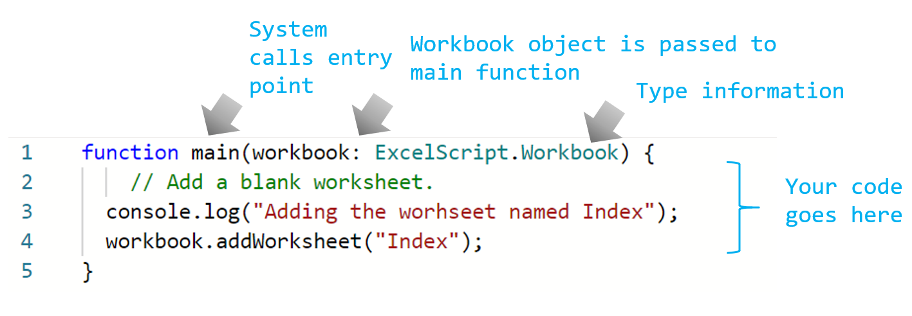
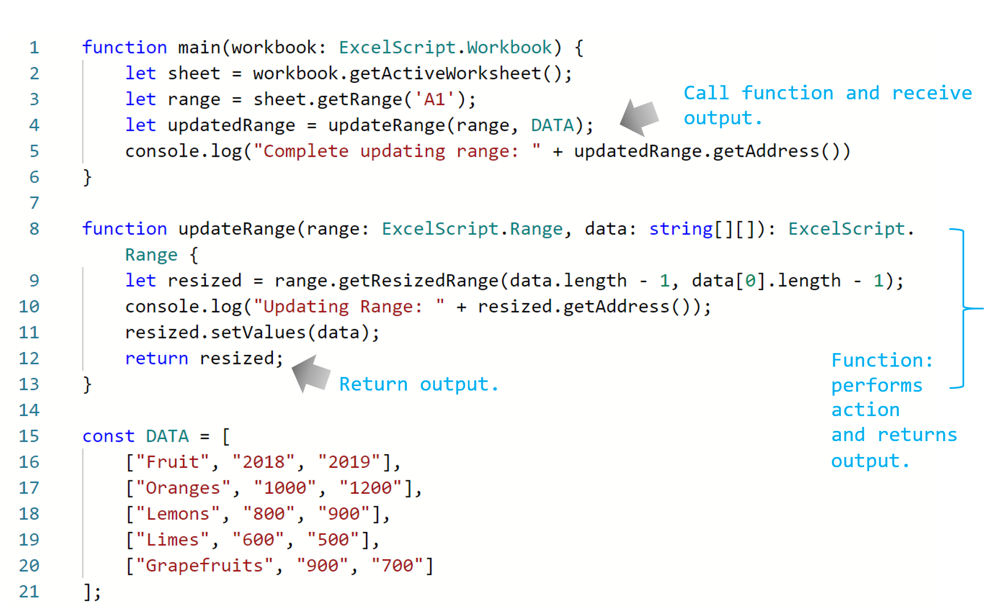
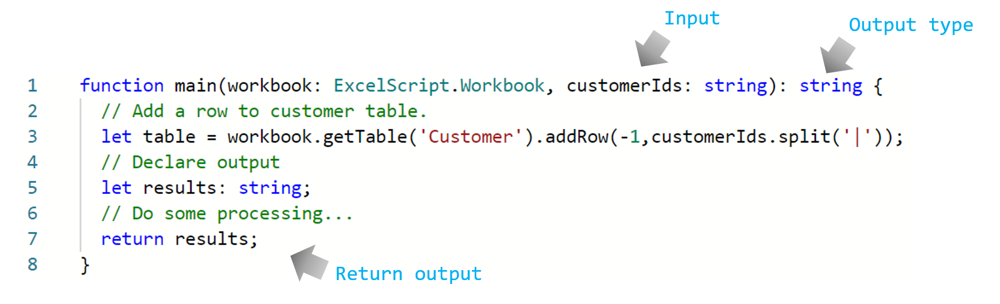

# Getting started 

This section provides details about the basics of Office Scripts including access, environment, script fundamentals and few basic script patterns. 


## Content

* [Access, environment and editor](#environment)
* [Anatomy of a script and basic pattern](#anatomy-of-a-script-and-basic-pattern)
* [Range basics](#range-basics)
* [Basic performance considerations](#basic-performance-considerations)
* [Error handling](#error-handling)
* [Note to VBA developers](#note-to-vba-developers)


## Environment 

Learn about the basics access, environment, and script editor. 

[](https://youtu.be/vvCtxsjPxo8 "Basics of Office Scripts application")

### Access

Office Scripts requires a admin settings available for M365 administrator under Settings > Org settings > Office Scripts. By default, it is turned on for all users. There are two sub settings, which the admin can turn on/off. 

* Ability to share scripts within the organization
* Ability to use scripts in Power Automation

You can tell if one has access to Office Scripts by opening an Excel file on the web (browser) and seeing if "Automate" tab appears in the Excel ribbon or not. 
If you still can't see the Automate tab, check [this troubleshooting section](https://docs.microsoft.com/office/dev/scripts/testing/troubleshooting#automate-tab-not-appearing-or-office-scripts-unavailable).

### Availability 
Office Scripts is available only in the Excel for web for Enterprise E3+ liceses (Consumer, E1 accounts are not supported).  Excel desktop/MacOS versions are not yet supported. 

### Scripts and editor

The code editor is built right into Excel for web (online version). If you have used VS Code or Sublime editors, this editing expereince will be quite similar. 
Most of the short-cut keys that VS Code editor uses works in the Office Script editing experience as well. Checkout the following short-cut keys handout: 
* https://code.visualstudio.com/shortcuts/keyboard-shortcuts-macos.pdf
* https://code.visualstudio.com/shortcuts/keyboard-shortcuts-windows.pdf

_Key things to note_

* Office Scripts is only available for files stored in OneDrive for Business, SharePoint sites, Team sites.
* The editor doesn't show the script's extension. In reality these are TypeScript files - but they are stored with a custom extension called `.osts`. 
* The scripts are stored in your own OneDrive for Business folder `My Files/Documents/OfficeScripts`. You'll not need to manage this folder. For your part, you can ignore this aspect as the editor manages the viewing/editing expereince.
* Scripts are not stored as part of Excel files. They are stored separetely. 
* You can share the script with an Excel file - which in affect means you are linking the script with the file (not attaching it). Whoever has access to the Excel file will also be able to 'view' or 'run' or 'make copy' of the script. This is a key difference compared to VBA macros. 
* Unless you share your scripts, no one else can access it as it resides in your own library. 
* Scripts cannot be linked from a local disk or custom cloud locations. Office Scripts only recognizes/runs script that are on pre-defined location (your OneDrive folder mentioned above) or shared scripts. 
* While editing, files are temporarily saved in the browser - but you'll have to 'save' the script before closing the Excel window to save it to the OneDrive loction. Don't forget to save the file after edits. 

## Anatomy of a script and basic pattern

Office Scripts consists of individual script files that are stand-alone and instructs Excel to perform some automation against the workbook it is executed on. All scripts are stored in separate files and stored on user's OneDrive folder. You can record a new script, edit recorded script or write a whole new script from the scratch all within built-in editor interface. The best part of scripts is that they don't need any further setup from users. No external libraries, web pages or UI elements, setup, etc. All of the environment setup are handled by the Office Scripts and it allows easy and fast access to automation thorugh simple API interface. 

Some of the basic pattern helpful to understand to edit and navigate around scripts include: 

* Basic language syntax, defining types 
* Understanding of `main` function and parameters.
* Object hierarchy and relationships, methods, properties.
* Collection (array) navigation and operations. 
* Type definitions

This section explains some of the above concepts in detail. 

#### Language - TypeScript 

[Office Scripts](https://docs.microsoft.com/office/dev/scripts/) is written using [TypeScript language](https://www.typescriptlang.org/), which is an open-source language that builds on JavaScript, one of the world’s most used tools, by adding static type definitions. As the website says, `Types` provide a way to describe the shape of an object, providing better documentation, and allowing TypeScript to validate that your code is working correctly. 

The language syntax itself is written using [JavaScript](https://developer.mozilla.org/en-US/docs/Web/JavaScript) with additional typings defined in the script using TypeScript conventions. For the most part, you can think of Office Script as written in JavaScript. It is essential that you understand basics of JavaScript language to begin your Office Scripts journey; though you don't need to be proficient at it use automation. Office Scripts' action recorder makes it easy to understand the script statements by adding code comments and allowing you to follow along and make small edits.  

Office Scripts APIs can be invoked in synchronously - no promises or callbacks. ​It's designed for end users who may not have any programming background. API design provides: 

* Simple object model with methods, getter/setters
* Easy to access object collections as regular arrays.
* Simple error handling options, and more. 
* Optimized performance for select scenarios helping users to focus on the scenario at hand. 

### `main` function - script's starting point 

Office Scripts' execution begins at the `main` function. A script is a single file containining one of many functions along with type/interface declarations, variable declaration, etc. To follow along the script, begin with `main` function as Excel always invokes the `main` function when you execute any script. The `main` function will always have at least one argument (or parameter) named `workbook`, which is just a variable name identifying the current workbook against which the script is running. One can define additional argument for usage with Power Automation (offline) execution. 

* `function main(workbook: ExcelScript.Workbook)`

Script can be organized into many smaller functions to aid with code re-usability, clarity, etc. Other functions can inside or outside of the main function - but always in the same file. A script is self contained and can only use functions defined in the same file. Scripts cannot invoke or call another Office Script. 

So, in summary: 

* `main` funciton is the entry point for any script. When the function is executed, Excel application invokes this main function by providing the workbook as its first parameter. 
* It is important to keep the first argument `workbook` and its type declaration as it appears. You can add new arguments to `main` function (See below section) - but do keep the first argument as is. 


] 


#### Use functions to organize and re-use code

] 

#### You can send or receive data from other apps 

You can connect the Excel to other parts of your organization by running scripts in [Power Automation](https://flow.microsoft.com). [See here for more details](https://docs.microsoft.com/en-us/office/dev/scripts/develop/power-automate-integration) about running Office Scripts in Power Automation flows.

The keys to receiving or sending data from/to Excel is through the main function. Think of it as the information gateway that allows incoming and outgoing data to be described and used in the script. You can receive data from outside in the form of `string` data type and return any TypeScript recognized data such as `string`, `number`, `boolean`, or any objects in the form of interface you define in the script. 




### Objects  

All of the Excel's object model is defined in a hierarchical structure of objects, beginning with workbook object of type `ExcelScript.Workbook`. An object can contain methods, and other objects (rarely) within it. Objects are linked to each other using the methods - an object's method can return another object or collection of objects. Using code editor's IntelliSence (code completion) feature is a great way to explore the object hierarchy. You can also use the [official reference documentation site](https://docs.microsoft.com/en-us/office/dev/scripts/overview/excel) to follow along the relationships among objects. 

### Get object reference 

You can get object reference by fetching the object using `get` method or by retrieving the collection of objects as shown below: 

```ts
function main(workbook: ExcelScript.Workbook) {
    // Get the active worksheet.
    const sheet = workbook.getActiveWorksheet();
    // If you want to fetch using an ID or key
    const sheet = workbook.getWorksheet('SomeSheetName');
    // Invoke methods on the object 
    sheet.setPosition(0); 
    
    // Get collection of methods
    const tables = sheet.getTables();
    console.log('Total tables in this sheet: ' + tables.length);
}
```

### Check if an object exists, delete and Add

For creating an object, say with a pre-defined name, it is always better to remove similar object that may exist and then add it. You can accompliush that using this pattern:

```ts
function main(workbook: ExcelScript.Workbook) {
  // Name of the worksheet to be added. 
  let name = "Index";
  // Check if the worksheet already exists. If not, add the the worksheet.
  let sheet = workbook.getWorksheet('Index');
  if (sheet) {
    console.log(`Worksheet by the name ${name} already exists. Deleting it.`);
    // Call the delete method on the object to remove it. 
    sheet.delete();
  } 
    // Add a blank worksheet. 
  console.log(`Adding the worhseet named  ${name}.`)
    workbook.addWorksheet("Index");
}

```

Alternately, for deleting an object that may or may not exist, use this pattern: 

```ts
    workbook.getWorksheet('Index')?.delete(); // The ? preceding the delete() will ensure that the API is only invoked if the object exists. 
```
### Collections 

Collections are objects such as tables, charts, columns, etc. that can be retrived as an array and iterated over for processing. You can retrieve a collection using corresponding `get` method and process the data in a loop using one of many TypeScript array traversal techniques such as:

* [`for` or `while`](https://developer.mozilla.org/en-US/docs/Web/JavaScript/Guide/Loops_and_iteration)
* [`for..of`](https://developer.mozilla.org/en-US/docs/Web/JavaScript/Reference/Statements/for...of)
* [`forEach`](https://developer.mozilla.org/en-US/docs/Web/JavaScript/Reference/Global_Objects/Array/forEach), etc.

* [Language basics of arrays](https://developer.mozilla.org/en-US/docs/Learn/JavaScript/First_steps/Arrays)


This script demonstrates how to use collections used in Office Scripts Excel APIs. 

```ts 

function main(workbook: ExcelScript.Workbook) {

  // Get all sheets as a collection. 
  const sheets = workbook.getWorksheets();
  const names = sheets.map ((sheet) => sheet.getName());
  console.log(names);
  console.log(`Total worksheets inside of this workbook: ${sheets.length}`);
  // Get information from specific sheets within the collection 
  console.log(`First sheet name is: ${names[0]}`);
  if (sheets.length > 1) {
    console.log(`Last sheet's Id is: ${sheets[sheets.length -1].getId()}`);
  }  
  // Color each worksheet with random color
  for (const sheet of sheets) {
    sheet.setTabColor(`#${Math.random().toString(16).substr(-6)}`);
  }
}
```

### Type definitions

Type declarations help users understand the type of variable they are dealing with. It helps with auto completion of methods and assists in development time quality checks. 
You can fine type declarations in the script in various places including function declaration, variable declaration, IntelliSence definitions, etc. 

Examples: 

* `function main(workbook: ExcelScript.Workbook)`
* `let myRange: ExcelScript.Range;` 
* `function getMaxAmount(range: ExcelScript.Range): number`

You can identify the types easily in the code editor as it appears distinctly usually in a different color. The color `:` usually preceds the type declaration.  

Writing types can be optional in TypeScript, because type inference allows you to get a lot of power without writing additional code. For the most part TypeScript language is good at inferring the types of variables. However, in certain cases, Office Script will require the type declarations be explicitly defined if the language is unable to clearly identify the type. Also, explicit or implicit `any` is not allowed in Office Script. More on that below 

#### 'any' type in the script

As the [TypeScript website states](https://www.typescriptlang.org/docs/handbook/basic-types.html#any), in some situations, not all type information is available or its declaration would take an inappropriate amount of effort. These may occur for values from code that has been written without TypeScript or a 3rd party library. In these cases, we might want to opt-out of type checking. To do so, we label these values with the `any` type:

```typescript
declare function getValue(key: string): any;
// OK, return value of 'getValue' is not checked
const str: string = getValue("myString");
```

**Explicit `any` is not allowed**

```typescript
let someVariable: any; 
// ^^ This is not allowed ^^
```

The `any` type presents challenges to the way Office Script processes the Excel APIs. It causes issues when the variables are sent to Excel APIs for processing. Knowing the type of variables used in the script is essential to the processing of script and hence explicit definition of any variable with `any` type is prohibited. You will receive a compile time error (error prior to the running of the script) if there is any variable with `any` type defined in the script. You will see an error on the editor as well. 

] 

] 

In the above code `[5, 16] Explicit Any is not allowed` indicates that line # 5 column # 16 defines `any` type. This helps to locate the error line. 

To get around this issue, always define the type of the variable. 

If you are uncertain about the type of a variable, one cool trick in TypeScript allows you to define [union types](https://www.typescriptlang.org/docs/handbook/unions-and-intersections.html). This can be used for variables to hold range value, which can be only of many types. 

```typescript
   let value: (string | number | boolean);
   // ^^ define this as a union type rather than any type ^^
   value = someValue_from_another_source;
   //...
   someRange.setValue(value);
```

#### Type inference 

In TypeScript, there are several places where [type inference](https://www.typescriptlang.org/docs/handbook/type-inference.html) is used to provide type information when there is no explicit type annotation. For example, in this code

```typescript
let x = 3;
//  ^ = let x: number
```

The type of the x variable is inferred to be number. This kind of inference takes place when initializing variables and members, setting parameter default values, and determining function return types. 


#### no-implicit-any rule
A script requires the types of the variables used to be explicitly or implicity defined. If TypeScript compiler is unable to determine the type of a variable (either because type is not defined explicitly or type inference is not not possible), then you will receive a compilation time error (error prior to the running of the script).  You will see an error on the editor as well.


Following scripts will receive compilation time error as variables are defined without any types and TypeScript cannot determine the type at the time of declaration. 

```typescript
function main(workbook: ExcelScript.Workbook) {
    let value; 
    // ^^ the variable 'value' gets 'any' type as no type is defined. ^^
    value = 10; 
    // ^^Even when a numer type is assigned, the type of 'value' remains any. ^^
    workbook.getActiveCell().setValue(value);
    // ^^ Above line will fail because Office Scripts can't send an argument of type 'any' to Excel for processing. ^^
    return;
}
```

```typescript
function main(workbook: ExcelScript.Workbook) {
    let cell; 
    // ^^ the variable 'cell' gets 'any' type as no type is defined. ^^
    cell = workbook.getActiveCell().getValue();
    console.log(cell.getValue());
    // ^^ Office Scripts cannot assign Range type object to 'any' type variable. ^^    
    return;
}
```

To avoid this, use following instead. In each case, the type is declared at the time of declaration of variable. 

```typescript
function main(workbook: ExcelScript.Workbook) {
    const value: number = 10; 
    workbook.getActiveCell().setValue(value);
    return;
}
```

```typescript
function main(workbook: ExcelScript.Workbook) {
    const cell: ExcelScript.Range = workbook.getActiveCell().getValue();
    console.log(cell.getValue()); 
    return;
}
```


## Range basics 

Checkout the [Range Basics](../Range%20Basics) before you go further on your journey. 

## Basic performance considerations

### Avoid slow operations in the loop

Certain operations when done inside/around the loop statements such as `for`, `for..of`, `map`, `forEach`, etc. can lead to slow performance. Avoid the following patterns:

* `get*` APIs 

Read all the data you need outside of the loop rather than reading it inside of the loop. At times, it is hard to avoid reading inside of loops - in such a case, make sure your loop counts are  not too large or manage them in batches to avoid having to loop through a large data structure. 

**Note**: If the range/data you are dealing with is quite large (say >100K cells), you may need to use advanced techniques like breaking-up your read/writes into multiple chunks. The following video is really for small-mid size data setup. For large dataset, refer to [advanced data write scenario](../Performance#large-data-write-scenario)

[](https://youtu.be/lsR_GvVW3Pg "Read and write optimization tip")

* `console.log` in the loop slows down the script 

```ts
    // Color each cell with random color
    for (let row = 0; row < rows; row++) {
        for (let col = 0; col < cols; col++) {
            range
                .getCell(row, col)
                .getFormat()
                .getFill()
                .setColor(`#${Math.random().toString(16).substr(-6)}`);
            /* Avoid such console.log in side loop */    
            // console.log("Updating" + range.getCell(row, col).getAddress()); 
        }
    }
```

* `try {} catch ()` statement 

Avoid exception handling for loops. Both inside and outside loops. 

## Error handling 

Office Scripts error can be classified into one of the following categories:

1. Compile time warnings shown in the editor 
1. Compile time error that appears when you run - it occurs before the execution begins 
1. Runtime error 

Editor warnings can be identified using the red underlines in the editor: 


At times, you may also see orange warning underlines and grey informational messages. They should be examined closely - though they are not going to cause errors. 

It is not not possible to distinguish between compile time and runtime errors as both error message will look identical. They both occur when you actually execute the script. See below for an example of compile time error followed by runtime error. 


In both cases, you will see the line # where the error occured. You can then examine the code, fix the issue and run again. 

Below are few best practices to avoid runtime errors.

### Check for object existance before deletion 

Alternately, for deleting an object that may or may not exist, use this pattern: 

```ts
    workbook.getWorksheet('Index')?.delete(); // The ? preceding the delete() will ensure that the API is only invoked if the object exists. 

    // Alternate way -- 
    const indexSheet = workbook.getWorksheet('Index');
    if (indexSheet) {
        indexSheet.delete();
    }
```

### Do pre-checks at the beginning of the script

As a best practice, always ensure that all your inputs are present in the Excel file prior to running your script. You may have made certian assumptions about objects being present in the workbook. If those objects don't exist, your script may encouter an error when you read the object or its data. Rather than beginning the processing and erroring in the middle after part of the updates/processing has already finished, it is better to do all pre-checks at the start of the script. 

Example: 

The following script requires two tables by the name of Table1 and Table2 to be present. Hence it checks their presence and ends the script with `return` statement if they are not present with appropriate message. 


```ts
function main(workbook: ExcelScript.Workbook) {

  // Tables that should be part of the workbook for the script to work:
  const TargetTableName = 'Table1';
  const SourceTableName = 'Table2';

  // Get the table objects
  let targetTable = workbook.getTable(TargetTableName);
  let sourceTable = workbook.getTable(SourceTableName);


  if (!targetTable || !sourceTable) {
    console.log(`Tables missing - Check to make sure both source (${TargetTableName}) and target table (${SourceTableName}) are present before running the script. `);
    return;
  }
  // Continue....

```

If the verification to ensure input data is present or not is happening in a separate function, it is important to end the script by issueing `return` statement from the `main` function. 

For example, `main` function calls `inputPresent` function to do the pre-checks. The `inputPresent` just returns a boolean (true or false) indicating whether all required inputs are present or not. It is the then the responsibility of the `main` function to issue `return` statement (from within same the `main` function) to end the script immediately. 


```ts
function main(workbook: ExcelScript.Workbook) {

  // Get the table objects
  if (!inputPresent(workbook)) {
    return;
  }
  // Continue....

}

function inputPresent( workbook: ExcelScript.Workbook): boolean {

  // Tables that should be part of the workbook for the script to work:
  const TargetTableName = 'Table1';
  const SourceTableName = 'Table2';

  // Get the table objects
  let targetTable = workbook.getTable(TargetTableName);
  let sourceTable = workbook.getTable(SourceTableName);

  if (!targetTable || !sourceTable) {
    console.log(`Tables missing - Check to make sure both source (${TargetTableName}) and target table (${SourceTableName}) are present before running the script. `);
    return false;
  }
  return true; 

}
```

### When to abort (throw) the script  

For the most part, you don't need to abort (`throw`) from your script. This is because the script's purpose here is to inform the user that script failed to run due to the absence of input data. Ending the script with an error message is sufficient in most cases and is lot simpler to simply `return` out of the `main` function. 

However, if your script is running as part of Power Automation, you may want to abort the flow if certain conditions are not met. It is therefore important to not `return` upon an error but rather issue `throw` statement to abort the script so that following step doesn't run. 

```ts
function main(workbook: ExcelScript.Workbook) {

  // Tables that should be part of the workbook for the script to work:
  const TargetTableName = 'Table1';
  const SourceTableName = 'Table2';

  // Get the table objects
  let targetTable = workbook.getTable(TargetTableName);
  let sourceTable = workbook.getTable(SourceTableName);


  if (!targetTable || !sourceTable) {
    // Abort script
    throw `Tables missing - Check to make sure both source (${TargetTableName}) and target table (${SourceTableName}) are present before running the script. `;
  }
  
```

As mentioned in the following section, another scenario is when you have a several functions involved (main calls functionX which calls functionY, etc.) which makes it hard to propagate the error. Aborting/throwing from the nested function with a message may be easier than returning error all the way up to `main` and returning from `main` with an error message. 

### When to use try..catch (throw exception)

[`try..catch`](https://developer.mozilla.org/en-US/docs/Web/JavaScript/Reference/Statements/try...catch) technique is a way to detect if an API call failed and handling the such error in your script. It may be important to check the return value of an API to verify that it completed successfully. 

Example: consider following snippet -

```ts
function main(workbook: ExcelScript.Workbook) {

  // somewhere in the script, perform a large data update
  range.setValues(someLargeValues);

}
```

The `setValues()` may fail resulting in the script failure. You may wish to handle this condition in your code and perhaps customize the error message or break-up the update into smaller units, etc. In that case, it is important to know that the API returned an error and interpret or handle that error. 

```ts
    try {
        range.setValues(someLargeValues);
    } catch (error) {
        console.log(`The script failed to update the values at location ____. Please inspect and run again.`);        
        console.log(error);      
        return; // End script (assuming this is in main function)  
    }

    // or...

    try {
        range.setValues(someLargeValues);
    } catch (error) {
        console.log(`The script failed to update the values at location ____. Trying a different approach`);        
        handleUpdatesInSmallerChunks(someLargeValues);
    }
    // Continue

```

Another scenario is when main function calls another funciton, which in-turn calls another function (and so on..) and the API call that you care about happens down in the bottom function. Propagating error up all the way to `main` may not be feasible or convenient. In that case, throwing error in the bottom function will be most convenient. 

```ts

function main(workbook: ExcelScript.Workbook) {
    ...
    updateRangeInChunks(sheet.getRange("B1"), data);
    ...
}

function updateRangeInChunks(
    ...
    updateNextChunk(startCell, values, rowsPerChunk, totalRowsUpdated);
    ...
}

function updateTargetRange(
      targetCell: ExcelScript.Range, 
      values: (string | boolean | number)[][]
    ) {
    const targetRange = targetCell.getResizedRange(values.length - 1, values[0].length - 1);
    console.log(`Updating the range. ${targetRange.getAddress()}`);
    try {
      targetRange.setValues(values);
    } catch (e) {
      throw `Error while updating the whole range: ${JSON.stringify(e)}`;
    }
    return;
}

```

*Warning* - Using `try..catch` inside of a loop will slow down your script. Avoid using this inside of or around loops. 

## Note to VBA developers

TypeScript language differs from VBA both syntactically as well in naming conventions.

Checkout the following snippets that achieves the same thing:

```vba
Worksheets("Sheet1").Range("A1:G37").Clear
```

```ts
workbook.getWorksheet('Sheet1').getRange('A1:G37').clear(ExcelScript.ClearApplyTo.all);
```

Few things to call out are: 

* You'll notice that all methods will need have open/close parenthesis to execute. Arguments are passed identically - but some arguments may be are required for execution (required vs optional). 
* The naming convention follows camelCase as opposed to PascalCase convention. 
* Methods usually have get or set prefixes indicating whether it is reading or writing object members. 
* The code blocks are defined and identified by open/close of curly braces: `{` `}`. Blocks are required for `if` conditions, `while`, `for` loops, function definition, etc. 
* Functions can call other functions and you can even define functions within a function. 

Overall, TypeScript is a different languages and there are few similarties between them. However, the Office Scripts API themsleves uses similar terminology and data-model (OM) hierarchy as VBA APIs and that should help you navigate around. 
