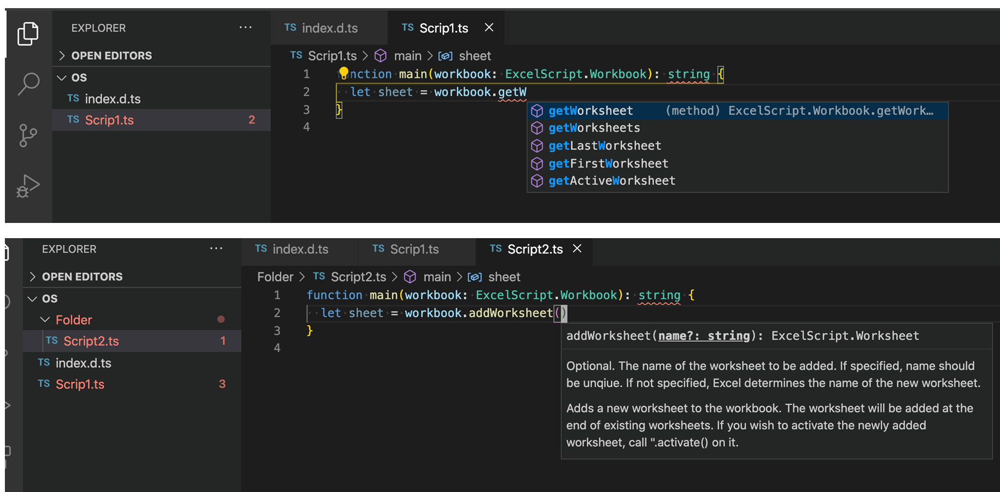

# Miscelaneos tips

## Full screen editor

Office Scripts doesn't yet offer a full-screen detachable editor. In the meantime, you can use the following steps to use the VS Code client editor to get code completion. It's just for editing purpose only - can't execute script using this. In order to execute, you'd still have to copy/paste code in the Office Scripts in-built code editor (bummer). 

1. Download the intellisence (code completion assistance) [file](index.d.ts) to your local machine into a folder from where you'll store your script files. 
1. You can see below that I have saved this file to a folder called OS. In here, I can start authoring the script and I get code completion. Of course I can’t test or run the code from here. For that I still have to copy/paste the code back to Code editor within Excel on the browser. 
1. The key is to name the script file locally with .ts extension. Otherwise, the code completion doesn’t work. This only works with VS Code editor. 
1. This is a not so great workaround to get larger editor.. but I personally use it when I’m editing a large script. 

